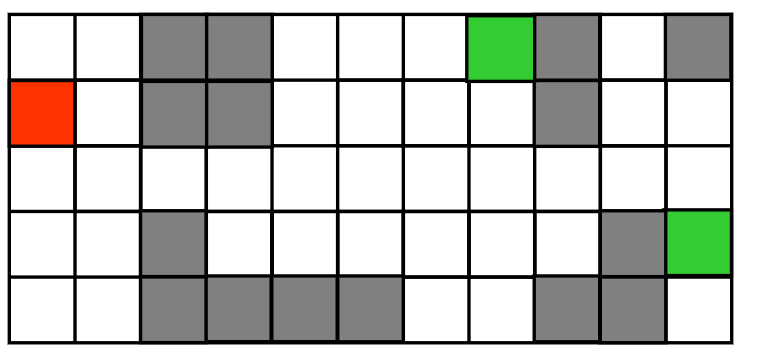

<!DOCTYPE html>
<html lang="en">

<head>
<meta charset="UTF-8">
<meta name="viewport" content="width=device-width, initial-scale=1.0">
</head>

<body>
<h1>Robot Navigation Pathfinding Program</h1>

<h2>Usage Instructions</h2>

<h3>Prerequisites</h3>

Make sure you have a compatible operating system (Windows, macOS, Linux) with a command-line interface.

<h3>Getting Started</h3>
<ol>
<li>Clone or download this repository to your local machine.</li>
<li>Ensure you have the necessary input files for testing located in the program directory.</li>
</ol>

<h3>Running the Program</h3>
<ol>
<li>Open a command prompt or terminal.</li>
<li>Navigate to the directory where the program and batch testing files are located using the <code>cd</code>
command.</li>
<li>To initiate the program, use the following command syntax: 
<code>search &lt;filename&gt; &lt;method&gt;</code> 
- Replace <code>&lt;filename&gt;</code> with the name of the file or input data you want to test with the
search program. 
- Replace <code>&lt;method&gt;</code> with the desired search method (<code>bfs</code> for Breadth-First
Search, <code>dfs</code> for Depth-First Search, or <code>gbfs</code> for Greedy Best-First Search).
</li>
</ol>

<h3>Example</h3>
<code>search input_data.txt bfs</code>

<h2>Program Output</h2>

The program will execute the specified search algorithm on the provided input file and display the results in
the command-line interface. You can capture and save this output for analysis or further processing.

<h2>Contributing</h2>

Contributions are welcome! If you find any bugs or want to suggest improvements, please feel free to open an
issue or submit a pull request.

<h2>License</h2>

This project is licensed under the <a href="LICENSE">MIT License</a>.

</body>

</html>
